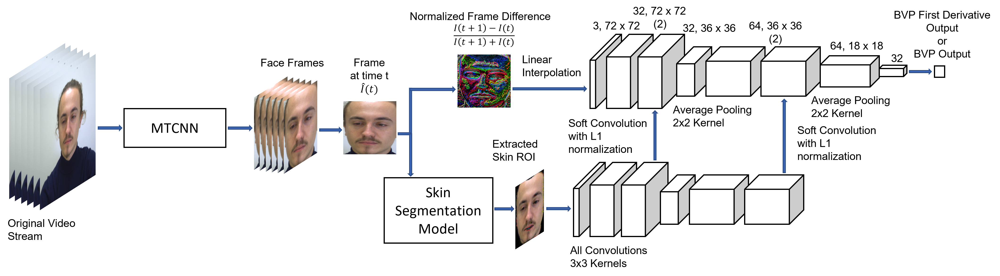
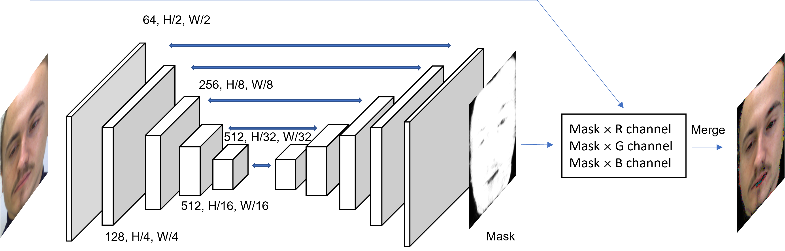
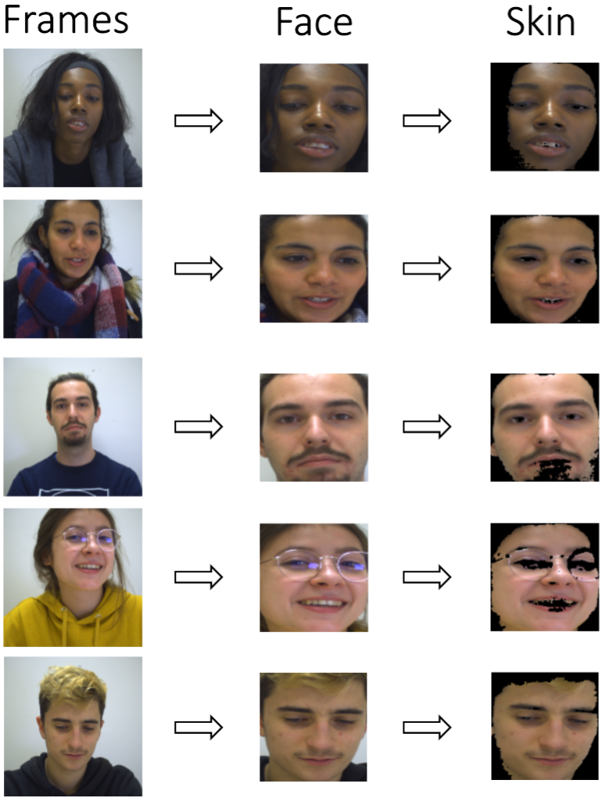

# CVPM 2023
Source code for the paper 'Camera-based Recovery of Cardiovascular Signals from Unconstrained Face Videos Using an Attention Network'  
[Project Page](https://sites.google.com/view/vt-tricam-ppg)

#### <u>Abstract:</u>
This work addresses the problem of recovering the morphology of blood volume pulse (BVP) information from a video of a person's face. 
Video-based remote plethysmography methods have shown promising results in estimating vital signs such as heart rate and breathing rate. 
However, recovering the instantaneous pulse rate signals is still a challenge for the community. This is due to the fact that most of the 
previous methods concentrate on capturing the temporal average of the cardiovascular signals. In contrast, we present an approach in which 
BVP signals are extracted with a focus on the recovery of the signal morphology as a generalized form for the computation of physiological metrics. 
We also place emphasis on allowing natural movements by the subject. Furthermore, our system is capable of extracting individual BVP instances with 
sufficient signal detail to facilitate candidate re-identification. These improvements have resulted in part from the incorporation of a robust skin-detection 
module into the overall imaging-based photoplethysmography (iPPG) framework. We present extensive experimental results using the challenging UBFC-Phys dataset 
and the well-known COHFACE dataset.

Figure 1: The complete proposed architecture. Face extraction is performed by the MTCNN module, and skin detection is performed on
these areas of interest to recover the required ROI’s. From a single frame difference, the system generates a single signal value either for a
BVP signal or for a temporal derivative of the BVP signal.

Figure 2: Our skin segmentation model is a fully convolutional network (FCN) based encoder-decoder network. This subsystem
generates a face mask in which skin pixels are detected.

Figure 3: Example output for some of the important cases from UBFC Phys Dataset, using our ROI pipeline. The
system extracts the face region and detects skin while excluding major facial hair and divergent factors such as reflections from eyeglasses.

### Directory Format:
    .
    ├── UBFC Phys Dataset         # Complete UBFC-Phys Dataset
    ├── ubfcFrames                # Each Video_Frame.png from UBFC-Phys Dataset
    ├── ubfcaligned_img           # Each Face_Frame.png from UBFC-Phys Video_Frame Data
    ├── ubfcimages                # Each Skin_Frame.png from UBFC-Phys Face_Frame Data
    ├── myout_ubfcframes.csv      # .csv for each frame and corresponding ground truth bvp signal
    ├── myout_ubfcface.csv        # .csv for each face_frame and corresponding ground truth bvp signal
    ├── myout_ubfcskin.csv        # .csv for each skin_frame and corresponding ground truth bvp signal
    ├── COHFACE Dataset           # Complete COHFACE Dataset
    ├── cohfaceFrames             # Each Video_Frame.png from COHFACE Dataset
    ├── cohfacealigned_img        # Each Face_Frame.png from COHFACE Video_Frame Data
    ├── cohfaceimages             # Each Skin_Frame.png from COHFACE Face_Frame Data
    ├── myout_cohfaceframes.csv   # .csv for each frame and corresponding ground truth bvp signal
    ├── myout_cohfaceface.csv     # .csv for each face_frame and corresponding ground truth bvp signal
    ├── myout_cohfaceskin.csv     # .csv for each skin_frame and corresponding ground truth bvp signal
    ├── Test.py                   # All Preprocessing and .csv generation
    ├── npy                       # Used in detect_face.py
        ├── det1.npy
        ├── det2.npy
        ├── det3.npy
    ├── data_preprocess.py
    ├── detect_face.py
    ├── facenet.py
    ├── preprocess.py          # -------------------------------------
    ├── prediction_new.py      # All Skin Segmentation
    ├── aug_image
    ├── aug_lable
    ├── onehot.py
    ├── Skindata.py
    ├── Skindata_val.py
    ├── Jobpreskin.sh
    ├── fcn_model_6.pt
    ├── FCN.py                 # -------------------------------------
    ├── TrnTst_DeepPhys.py  # DeepPhys Implementation
    ├── DeepPhy.py
    ├── Testmodel.py
    ├── Jobframes1.sh
    ├── Jobtest.sh             # -------------------------------------
    ├── Deepyo.py              # My model Implementation
    ├── Jobfaceskin.sh
    ├── Jobtest_mymodel.sh
    ├── TestmodelRun.py
    └── TrnTstFaceSkin.py      # -------------------------------------

### Test.py

-> The code goes through all the videos, takes frames, passes them to retrive face and then .csv of video frame with 
corresponding BVP signal value is generated

-> It uses preprocess.py (which uses detect_face.py and facenet.py to do the face detection part)

### prediction_new.py

-> It is used generate all the skin frames from the face frames. It works with the FCN (Fully Convolutional Neural Network) module, generates the skin mask followed
by the skin frames and also creates a csv file with skin frames with their corresponding BVP ground truth signal values. 

### TrnTst_DeepPhys.py

-> Code to train DeepPhys model. It uses DeepPhys.py and the bash scrip Jobframes1.sh is used to run the model.

### TrnTstFaceSkin.py

-> Code to train my models. It uses Deepyo.py and the bash scrip Jobfaceskin.sh is used to run the model.

## Attention Masks

